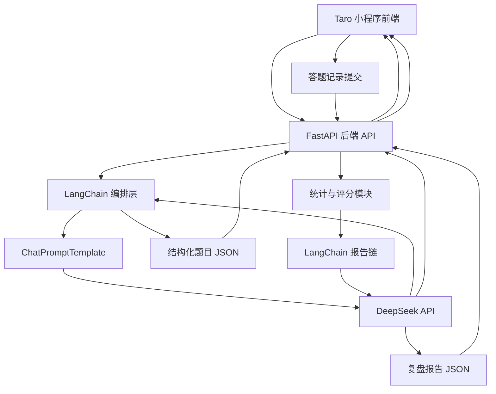
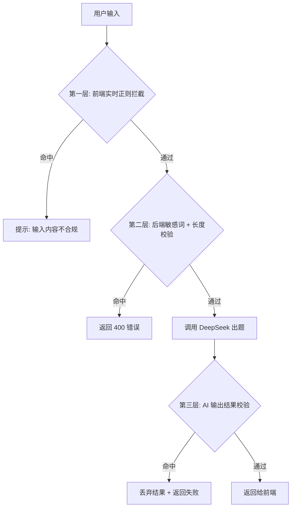
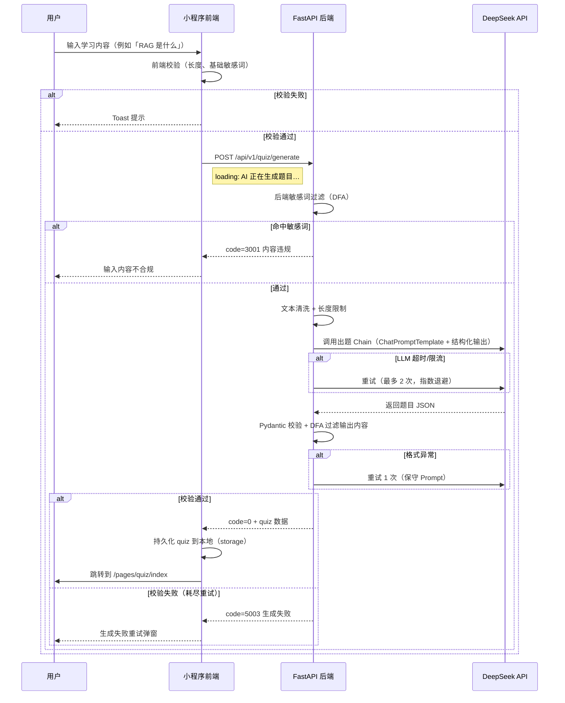
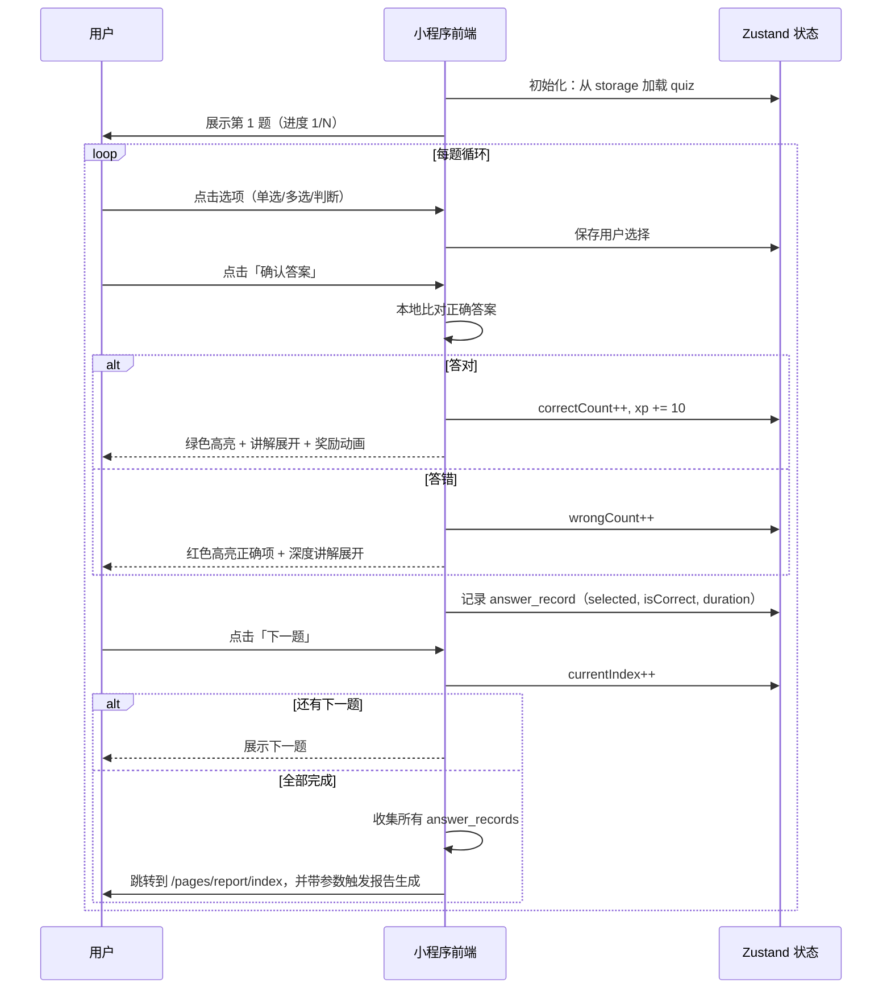
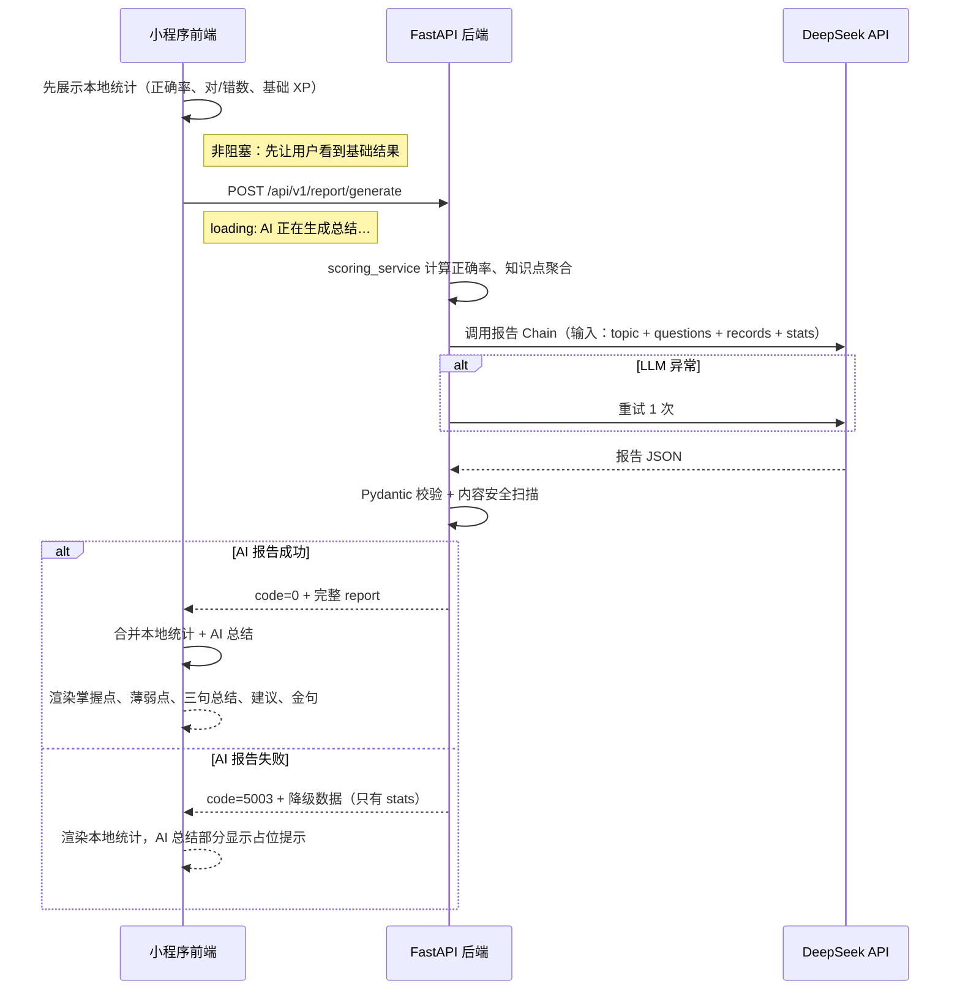

# 《智能 AI 闯关学习小程序》方案设计文档

## 1. 文档目标

本文档用于指导“智能 AI 闯关学习小程序”从 0 到 1 完成 MVP 方案设计与实施落地，重点解决以下问题：

1. 明确小程序前端技术选型，并给出可执行的推荐结论。
2. 围绕核心业务闭环设计整体架构：用户输入内容 => AI 生成题目 => 用户答题 => AI 生成分析报告。
3. 给出后端技术方案、核心 Prompt 设计、接口协议、领域数据模型和分阶段开发路径。
4. 对需求文档中的 todo 项进行收敛，区分“现在就做”和“后续再做”，避免前期工程失控。

本文档默认遵循以下前提：

- 后端语言采用 Python。
- 后端框架采用 FastAPI。
- 大模型采用 DeepSeek，优先使用 `deepseek-chat`。
- 大模型接入优先走 OpenAI 兼容 API。
- MVP 阶段不以联网搜索、用户系统、数据库建模、多模态为重点。
- MVP 的第一目标不是“功能全”，而是最短路径跑通核心学习闭环。

---

## 2. 需求收敛与 MVP 边界

### 2.1 产品目标

产品本质不是一个“传统题库系统”，而是一个“把任意输入知识快速转成闯关问答”的 AI 学习工具。用户价值主要来自三件事：

1. 降低学习材料处理门槛。
2. 通过问答闯关和即时讲解增强学习参与感。
3. 通过报告复盘形成学习闭环。

### 2.2 MVP 只保留的核心能力

结合需求文档与输出计划，MVP 只保留以下能力：

1. 用户输入一句话、一段文本或一个主题。
2. 后端调用 AI 生成 3 到 5 道题目，题型包含单选、多选、判断。
3. 用户逐题作答，提交后立即得到正确答案和详细讲解。
4. 全部题目完成后，系统生成知识总结、答题统计和复盘报告。

### 2.3 明确不前置的能力

以下能力保留在后续版本，不纳入 MVP 首轮开发：

1. 微信授权登录、用户注册、账号体系。
2. MySQL 正式库表设计与复杂持久化。
3. 网页抓取、PDF/Word/视频解析、联网搜索。
4. RAG 私有知识库、向量数据库。
5. 社交 PK、排行榜、分享裂变深度玩法。
6. 生图、语音、数字人等多模态能力。
7. 复杂商业化功能和支付链路。

### 2.4 方案设计原则

1. 先验证 AI 出题质量，再做外围系统。
2. 先做纯文本链路，再扩展多源输入。
3. 先做无状态或轻状态接口，再做用户中心。
4. 先保证题目结构化输出和解析稳定，再优化页面体验。
5. 所有设计以“单人独立开发、尽快上线验证”为第一约束。

---

## 3. 小程序技术选型对比

这是本项目最关键的技术决策之一。由于小程序生态更新很快，选型不能只看“理论能力”，而要看是否适合单人、快速交付、后续可扩展。

### 3.1 选型候选

本次重点比较以下四种方案：

1. 微信原生小程序
2. Taro
3. uni-app
4. uni-app x

### 3.2 对比维度

重点从以下维度比较：

- 学习与开发成本
- 微信小程序适配程度
- 多端扩展能力
- 生态成熟度
- 组件与插件可用性
- 性能与调试体验
- 对单人独立开发的友好度
- 对本项目 MVP 的适配程度

### 3.3 详细对比表

| 方案 | 技术栈 | 优势 | 劣势 | 适合场景 | 对本项目适配结论 |
| --- | --- | --- | --- | --- | --- |
| 微信原生小程序 | WXML / WXSS / JS / TS | 官方能力最完整，兼容性最好，微信特性接入最直接，问题定位最贴近平台 | 多端扩展差，工程化与组件生态相对分散，后续迁移 H5/App 成本高 | 只做微信单端、强依赖平台原生能力的项目 | 不是首选，除非明确永远只做微信单端 |
| Taro 4.x | React / Vue + Taro API | 开源、工程化成熟、对 VSCode 友好、多端扩展能力强，微信小程序/H5/RN 统一路径清晰，适合前后端分离项目 | 仍需理解小程序运行约束与跨端差异，首屏和组件细节需要按小程序思维处理 | 独立开发者或团队希望用现代前端工具链开发微信小程序，并保留后续扩展 H5 / RN 的空间 | 本项目推荐方案 |
| uni-app | Vue3 + uni API | 对中文开发者友好，微信小程序落地成熟，插件生态丰富，Vue3 开发效率高，多端扩展能力强，学习成本低 | 更偏 DCloud 工具链和生态，部分资料与插件默认按 HBuilderX 路径组织，CLI 工作流的工程一致性不如 Taro 明确 | 单人或小团队，接受 DCloud 生态、优先追求快速上手的业务 | 可用，作为第二备选 |
| uni-app x | uts + uvue | 面向未来的高性能跨端引擎，原生能力强，官方持续推进，已支持微信小程序 | 心智模型更重，需要理解 uts 与 uvue 约束，CSS 和生态兼容边界更多，且运行/发行工具链更依赖 HBuilderX | 高性能 App、多端统一原生化、愿意承担额外工程成本的团队 | 不适合作为当前 MVP 首发方案 |

### 3.4 最新调研结论

结合官方资料，可以得到以下关键判断：

1. `Taro 4.x` 仍然是当前开源跨端框架里非常稳妥的主流选择，支持 React / Vue，官方文档、社区案例和工程化能力都足够成熟。
2. 对本项目而言，`Taro 4.x` 更符合“VSCode 开发 + 微信开发者工具调试”的工作流，也更贴近现代前端工程体系。
3. `uni-app` 依然是可行方案，但如果目标明确是使用开源框架并弱化对 DCloud 工具链的依赖，`Taro` 更合适。
4. `uni-app x` 已经支持微信小程序，但它的核心价值更偏“高性能原生跨端”，工具链和心智成本都更重，不适合作为当前 MVP 的最低风险方案。
5. 微信原生虽然最稳定，但会限制未来扩展 H5 / RN / 其他小程序的路径，不利于该项目后续形成统一产品线。

### 3.5 最终推荐

**推荐结论：MVP 阶段采用 `Taro 4.x`。**

推荐理由如下：

1. 最符合“单人独立开发、最短时间交付”的约束。
2. `Taro 4.x` 是开源框架，便于坚持 `VSCode + CLI + 微信开发者工具` 的开发模式。
3. 微信小程序支持成熟，后续扩展 H5 或 RN 时保留更好的代码复用空间。
4. 更贴近现代前端工程体系，便于后续接入 ESLint、Prettier、测试和 CI。
5. 本项目前期重点不在极致性能，而在 AI 闭环验证，`Taro 4.x` 足够支撑。
6. 默认建议采用 `React + TypeScript` 方案；如果后续你明确想统一 Vue 生态，也可以切换到 `Taro Vue3`，但首版文档按 React 方案展开。

### 3.6 不推荐直接上 uni-app x 的原因

1. 当前 MVP 不是性能瓶颈型产品，不值得为了理论性能引入额外工程复杂度。
2. `uts` 和 `uvue` 的约束会增加学习和排障成本。
3. 对第三方 UI、NPM 生态和跨端样式约束的兼容判断更复杂。
4. 独立开发者第一阶段应该优先压缩变量，而不是引入下一代框架风险。

### 3.7 备选方案

如果你后续更希望降低学习成本，或者团队已有较多 Vue / uni-app 经验，则可以把 `uni-app Vue3` 作为第二推荐方案。

### 3.8 实际开发体验深度对比

以下维度是独立开发者在实际开发中每天都会遇到的，比理论对比更有决策价值：

| 对比维度 | 微信原生 | Taro 4.x (React) | uni-app (Vue3) | uni-app x |
| --- | --- | --- | --- | --- |
| **IDE 工作流** | 微信开发者工具单工具即可 | VSCode 编码 + 微信开发者工具预览调试，双工具切换 | HBuilderX 体验最优；也可 VSCode + CLI，但资料偏少 | 强依赖 HBuilderX，CLI 支持较弱 |
| **热更新速度** | 快，原生支持 | 中等，HMR 对小程序组件有兼容边界 | 中等，HMR 在 HBuilderX 下表现较好 | 较慢，uvue 编译链路更长 |
| **NPM 生态兼容** | 需手工构建，很多包不能直接用 | 支持较好，但需注意小程序端 polyfill | 插件市场丰富，npm 包兼容需按平台区分 | uts 生态尚在建设，npm 兼容边界较多 |
| **组件生态** | WeUI 等官方组件，第三方分散 | Taro 组件市场，NutUI、Taroify 等成熟 | uni-ui 生态丰富，uView、uv-ui 完善 | uvue 组件生态相对较新 |
| **调试体验** | DevTools 原生能力最强 | 可使用 React DevTools + 微信 DevTools 双路调试 | 主要依赖微信 DevTools，Vue DevTools 在小程序端受限 | 主要依赖 HBuilderX 内置调试 |
| **TypeScript 支持** | 需要额外配置 | 原生支持，与 React 体系一致 | 支持良好，与 Vue3 体系一致 | uts 自带类型，但语言心智不同 |
| **踩坑社区资源** | 官方文档全，问题分散 | GitHub Issues + 中文社区案例丰富 | DCloud 问答社区活跃，中文资料极多 | 资料相对较少，需要紧跟官方更新 |
| **单端开发体验评分** | 9/10 | 8/10 | 8/10 | 6/10 |
| **跨端迁移成本** | 极高（重写） | 低~中（大部分代码复用） | 低~中（大部分代码复用） | 低（同 uvue 体系内） |
| **独立开发者综合评分** | 7/10 | **9/10** | 8.5/10 | 6/10 |

### 3.9 小程序端常见限制与 Taro 应对策略

无论选哪个框架，小程序端都有一些硬限制必须提前规划。以下是本项目会遇到的主要问题及 Taro 下的应对方案：

**1. 包体积限制（单包 2MB，总包 20MB）**

- 策略：MVP 阶段不引入重型 UI 库，优先自定义轻量组件。
- 图片资源：首版不内嵌大图片，分享海报使用 Canvas 实时生成。
- 分包：后续扩展（如个人中心、设置页）可放分包。

**2. 样式限制**

- 小程序不支持通配符 `*` 选择器、不支持部分 CSS 伪类。
- Taro 提供 `@tarojs/plugin-remove-unused styles` 插件做样式优化。
- 推荐使用 CSS Modules 或 BEM 命名，避免样式穿透问题。

**3. Canvas 限制（分享海报用）**

- Taro 需使用 `Taro.createCanvasContext`，且要注意组件 type 为 2d。
- 海报生成必须走异步保存到相册链路，不能直接返回图。

**4. 小程序发布审核**

- AI 生成内容类小程序必须具备内容安全审核机制（后文专门设计）。
- 上线前需准备：类目选择（教育 > 在线学习）、隐私协议、用户内容举报入口占位。

### 3.10 前端框架选型最终确认与配置建议

**最终结论：Taro 4.x + React 18 + TypeScript**

配套关键配置：

```json
{
  "framework": "React",
  "compiler": "webpack5",
  "packageManager": "pnpm",
  "css": "sass",
  "lint": true,
  "eslint": true,
  "prettier": true
}
```

关键依赖版本锁定：

- `@tarojs/taro`: `^4.0.0`
- `@tarojs/cli`: `^4.0.0`
- `react`: `^18.2.0`
- `typescript`: `^5.0.0`
- `zustand`: `^4.4.0`（轻量状态管理）

---

## 4. 整体系统架构设计

### 4.1 架构目标

整体架构必须满足三件事：

1. 前后端可以并行开发。
2. AI 生成结果必须结构化，前端不能依赖脆弱的文本解析。
3. 后续扩展输入源、RAG、用户系统时，不需要推翻当前核心模块。

### 4.2 总体架构图



### 4.3 核心模块拆分

前端模块：

1. 首页输入模块
2. 题目闯关模块
3. 即时反馈模块
4. 报告展示模块

后端模块：

1. 接口层：处理 HTTP 请求、参数校验、响应封装
2. 应用服务层：编排出题、评分、报告生成流程
3. LangChain 编排层：维护 Prompt 模板、输出 Schema 和调用链
4. AI 适配层：通过 LangChain 统一封装 DeepSeek 调用
5. 领域模型层：题目、选项、答题记录、报告等数据结构
6. 基础设施层：日志、配置、异常、限流、敏感词过滤

### 4.4 数据流设计

#### 流程一：生成题目

1. 用户在首页输入学习主题或一段文本。
2. 前端调用后端 `生成题目接口`。
3. 后端清洗输入文本并做敏感词与长度校验。
4. 后端通过 LangChain 的 `ChatPromptTemplate` 组装提示词，并调用 DeepSeek。
5. 后端校验 JSON 结构是否合法。
6. 后端返回标准题库数据给前端。
7. 前端进入闯关页开始答题。

#### 流程二：用户答题

1. 前端展示题目与选项。
2. 用户选择答案后，前端本地比对正确答案并即时展示讲解。
3. 前端记录每题答题行为，包括答案、是否正确、用时。
4. 全部题目结束后，将本轮答题记录提交给后端。

#### 流程三：生成报告

1. 后端接收答题记录与原始题库。
2. 后端计算正确率、知识点掌握情况、薄弱点。
3. 后端通过 LangChain 报告链生成结构化复盘报告。
4. 前端渲染总结、正确率、知识建议和分享素材。

---

## 5. 技术栈设计

### 5.1 前端技术栈

- 框架：`Taro 4.x`
- 视图库：`React 18`
- 语言：`TypeScript`
- 状态管理：优先轻量方案，MVP 可使用 `Zustand` 或页面内状态
- 请求库：基于 `Taro.request` 的统一封装，或使用兼容良好的轻量请求层
- UI 策略：优先自定义轻量组件，不在 MVP 引入过重 UI 框架
- 构建工具：`Taro CLI + VSCode + 微信开发者工具`

### 5.2 后端技术栈

- Web 框架：`FastAPI`
- 运行环境：`Python 3.11+`
- 数据校验：`Pydantic v2`
- 模型编排框架：`LangChain`
- LangChain 模型适配：`langchain-openai`
- Prompt 模板：`ChatPromptTemplate`
- 结构化输出：`with_structured_output()` + `Pydantic`
- 配置管理：`pydantic-settings`
- 日志：`structlog` 或标准 logging
- 测试：`pytest`

### 5.3 为什么选 FastAPI

1. 参数校验与文档能力强，适合快速定义 AI 接口。
2. 天然生成 OpenAPI 文档，便于前后端并行联调。
3. 异步友好，后续接入解析任务、异步报告生成更平滑。
4. 对单人开发效率很高，工程心智负担低于传统框架组合。

### 5.4 为什么使用 LangChain 作为正式接入层

结合 LangChain 官方文档，本项目应当把 LangChain 作为 DeepSeek 的正式接入层，而不是仅作为可选辅助库。

推荐原因：

1. LangChain 官方推荐使用 `ChatPromptTemplate` 组织系统消息和用户消息，这比拼接长字符串 Prompt 更稳定、更易维护。
2. LangChain 官方提供结构化输出能力，可以直接把模型返回结果约束到 `Pydantic` Schema，适合本项目的题库 JSON 和报告 JSON 场景。
3. `langchain-openai` 的 `ChatOpenAI` 支持通过 `base_url` 和 `api_key` 对接 OpenAI 兼容接口，因此可以直接接 DeepSeek。
4. 把模型调用统一放在 LangChain 层，后续切换模型、增加重试、增加输出解析和引入 RAG 时，扩展路径更清晰。

使用边界也需要明确：

1. MVP 中使用 LangChain 的 `ChatPromptTemplate`、`ChatOpenAI`、`with_structured_output()`。
2. 不在首版引入 Agent、复杂工具调用、LangGraph 或重型 RAG 编排。
3. LangChain 是正式编排层，但仍要保留清晰的服务层与异常处理，不能把所有逻辑堆进链定义中。

结论是：**LangChain 是本项目对接 DeepSeek 的正式方案，但首版仅使用其稳定的 Prompt 与结构化输出能力。**

---

## 6. 后端架构设计

### 6.1 推荐项目结构

```text
backend/
  app/
    api/
      v1/
        routes/
          health.py
          quiz.py
          report.py
    core/
      config.py
      logging.py
      exceptions.py
      security.py
    models/
      quiz.py
      report.py
      common.py
    services/
      quiz_service.py
      report_service.py
      scoring_service.py
    prompts/
      quiz_prompt.py
      report_prompt.py
    llm/
      langchain_factory.py
      quiz_chain.py
      report_chain.py
      output_schemas.py
    utils/
      text_cleaner.py
      content_filter.py
      id_generator.py
    main.py
  tests/
    test_quiz_api.py
    test_report_api.py
    test_prompt_contract.py
  requirements.txt
```

### 6.2 分层职责

#### API 层

负责：

1. 请求参数校验
2. 返回码和响应格式统一
3. 错误码映射
4. 接口级日志记录

#### Service 层

负责：

1. 调用 LangChain 出题链或报告链
2. 组织输入参数并触发模型编排
3. 做 JSON 结果兜底校验
4. 组装业务响应对象

#### LLM 层

负责：

1. 基于 `langchain-openai` 初始化 DeepSeek 对应的 `ChatOpenAI`
2. 统一管理模型、温度、超时、重试配置
3. 通过 `ChatPromptTemplate` 和 `with_structured_output()` 生成可复用调用链
4. 统一处理模型空响应、格式异常、截断风险

#### Prompt 层

负责：

1. 维护版本化 Prompt 模板
2. 维护结构化输出 Schema
3. 提高出题质量一致性
4. 为未来 A/B Test 预留扩展点

---

## 7. DeepSeek 接入方案

### 7.1 模型选择

MVP 推荐：

- 首选：`deepseek-chat`
- 预留：`deepseek-reasoner`

推荐理由：

1. 出题与报告生成更关注稳定输出和成本平衡。
2. `deepseek-chat` 更适合标准化内容生成。
3. `deepseek-reasoner` 可作为高难题或复杂分析的后续增强能力，而不是 MVP 必需项。

### 7.2 接入方式

使用 `LangChain + langchain-openai` 对接 DeepSeek 的 OpenAI 兼容接口，推荐方式如下：

- 使用 `ChatOpenAI`
- `base_url = https://api.deepseek.com`
- `api_key = DEEPSEEK_API_KEY`
- `model = deepseek-chat`
- 通过 `ChatPromptTemplate` 构建消息模板
- 通过 `with_structured_output()` 约束输出到 `Pydantic` 模型

推荐代码形态：

```python
from langchain_openai import ChatOpenAI
from langchain_core.prompts import ChatPromptTemplate

llm = ChatOpenAI(
  model="deepseek-chat",
  base_url="https://api.deepseek.com",
  api_key="${DEEPSEEK_API_KEY}",
  temperature=0.4,
)

prompt = ChatPromptTemplate.from_messages(
  [
    ("system", "你是一名专业的 AI 学习教练。"),
    ("user", "{user_input}"),
  ]
)
```

### 7.3 JSON 输出策略

根据 DeepSeek 和 LangChain 官方文档，结构化输出建议按以下策略落地：

1. LangChain 层优先使用 `with_structured_output()` 约束输出 Schema。
2. Prompt 中仍然明确要求输出 JSON 语义，并给出目标字段结构。
3. DeepSeek 底层保持 OpenAI 兼容调用方式，必要时补充 `response_format` 约束。
4. `max_tokens` 要保守设置，防止结构体被截断。
5. 输出结果进入服务层后，仍需做字段完整性校验，不能只依赖模型侧保证。

### 7.4 可靠性设计

出题链路必须增加以下兜底：

1. 一级校验：检查返回内容是否为空。
2. 二级校验：检查 LangChain 结构化输出是否成功映射到 Schema。
3. 三级校验：检查字段是否完整，例如题目数、选项数、答案格式。
4. 四级校验：若失败，自动重试 1 到 2 次，并切换到更保守 Prompt。
5. 五级兜底：若仍失败，返回“生成失败，请重试”而不是把脏数据交给前端。

### 7.5 调用参数建议

出题接口建议：

- temperature: `0.4`
- top_p: `0.9`
- timeout: `30s`
- max_tokens: 根据题量控制在合理范围
- LangChain Runnable 超时与重试策略统一在模型工厂层配置

报告接口建议：

- temperature: `0.5`
- top_p: `0.9`
- timeout: `30s`
- 通过独立的报告链复用相同模型工厂配置

---

## 8. 核心 Prompt 设计

Prompt 设计直接决定 MVP 体验质量。首版不要追求花哨，要优先追求“稳定、结构化、可解析”。

### 8.1 出题 Prompt 目标

要求模型基于用户输入生成可直接渲染的题库 JSON，题目应覆盖：

1. 核心概念理解
2. 易错点辨析
3. 应用场景判断

### 8.2 出题 Prompt 设计原则

1. 明确题量，例如 5 题。
2. 明确题型比例，例如单选 3、多选 1、判断 1。
3. 明确输出字段。
4. 明确讲解必须通俗、简洁、适合小程序阅读。
5. 明确禁止输出 Markdown、额外说明、代码块。

### 8.3 出题 Prompt 示例

```text
你是一名专业的 AI 学习教练，请根据用户提供的学习内容生成一组用于小程序闯关答题的题目。

要求：
1. 输出必须是合法 JSON，不要输出任何 JSON 之外的内容。
2. 题目总数为 5 题。
3. 题型包含：3 道单选题、1 道多选题、1 道判断题。
4. 每道题必须包含：题目编号、题型、题干、选项、正确答案、详细讲解、知识点标签、难度。
5. 讲解必须适合初学者阅读，避免过度学术化。
6. 如果用户输入内容过短，可以基于常识进行合理补充，但不要偏离主题。

JSON 输出结构示例：
{
  "title": "学习主题",
  "summary": "本次题库的主题摘要",
  "questions": [
    {
      "id": "q1",
      "type": "single",
      "stem": "题干",
      "options": [
        {"key": "A", "text": "选项A"},
        {"key": "B", "text": "选项B"}
      ],
      "answer": ["A"],
      "explanation": "详细讲解",
      "knowledge_point": "知识点",
      "difficulty": "easy"
    }
  ]
}

用户学习内容如下：
{user_input}
```

### 8.4 报告 Prompt 目标

输入原始主题、题库、用户作答记录，输出结构化复盘报告。

### 8.5 报告 Prompt 输出内容

1. 本次正确率
2. 掌握较好的知识点
3. 薄弱知识点
4. 三句知识总结
5. 后续建议
6. 一句可用于分享的学习金句

### 8.6 报告 Prompt 示例

```text
你是一名学习复盘教练，请根据用户本次闯关答题记录生成一份结构化复盘报告。

要求：
1. 输出必须是合法 JSON。
2. 语言风格清晰、鼓励式，但不要空泛。
3. 分析应基于用户真实答题情况，不要编造未出现的结论。
4. 总结要适合移动端阅读。

JSON 输出结构示例：
{
  "accuracy": 80,
  "mastered_points": ["知识点1"],
  "weak_points": ["知识点2"],
  "three_line_summary": ["一句话1", "一句话2", "一句话3"],
  "advice": ["建议1", "建议2"],
  "share_quote": "今天我又闯过一个知识关卡"
}

用户主题：{topic}
题库数据：{quiz_json}
答题记录：{answer_records}
统计结果：{score_summary}
```

### 8.7 Prompt 版本管理建议

建议从一开始就做版本化：

- `quiz_prompt_v1`
- `quiz_prompt_v2`
- `report_prompt_v1`

这样后续优化模型输出时，不会影响接口调用方和测试基线。

---

## 9. API 接口设计

MVP 接口必须做到足够简单，让前后端并行开发不互相等待。

### 9.1 接口列表

#### 1. 健康检查

- `GET /api/v1/health`

用途：

- 检查后端服务是否启动

#### 2. 生成题库

- `POST /api/v1/quiz/generate`

请求体示例：

```json
{
  "user_input": "我想学习什么是 RAG，以及它和传统搜索有什么区别",
  "question_count": 5,
  "difficulty": "mixed"
}
```

响应体示例：

```json
{
  "quiz_id": "quiz_xxx",
  "title": "RAG 入门闯关",
  "summary": "围绕 RAG 基础概念与应用场景生成的题库",
  "questions": []
}
```

#### 3. 生成复盘报告

- `POST /api/v1/report/generate`

请求体示例：

```json
{
  "quiz_id": "quiz_xxx",
  "topic": "RAG 入门",
  "questions": [],
  "answer_records": [
    {
      "question_id": "q1",
      "selected_answers": ["A"],
      "is_correct": true,
      "duration_ms": 3200
    }
  ]
}
```

响应体示例：

```json
{
  "accuracy": 80,
  "mastered_points": ["RAG 的基本定义"],
  "weak_points": ["RAG 与搜索引擎的边界"],
  "three_line_summary": ["...", "...", "..."],
  "advice": ["...", "..."],
  "share_quote": "把知识做成关卡，记忆会更深。"
}
```

### 9.2 为什么不单独设计“提交单题答案接口”

MVP 阶段不建议把每道题都交给后端判题，原因如下：

1. 正确答案已在题库 JSON 中，前端可以即时反馈。
2. 单题提交会增加接口复杂度和网络等待。
3. 当前核心目标是验证题目质量和报告质量，不是做实时对战。

更合理的做法是：

1. 前端本地即时判题并展示讲解。
2. 全部题目结束后一次性提交作答记录生成报告。

### 9.3 统一响应规范

建议后端统一返回结构：

```json
{
  "code": 0,
  "message": "ok",
  "data": {}
}
```

错误时：

```json
{
  "code": 4001,
  "message": "题库生成失败，请稍后重试",
  "data": null
}
```

---

## 10. 领域数据模型设计

本节先定义业务对象，不展开正式库表设计。

### 10.1 Quiz

```json
{
  "quiz_id": "quiz_xxx",
  "title": "字符串",
  "summary": "字符串",
  "source_type": "text",
  "user_input": "原始输入",
  "questions": []
}
```

### 10.2 Question

```json
{
  "id": "q1",
  "type": "single|multiple|judge",
  "stem": "题干",
  "options": [
    {"key": "A", "text": "选项A"}
  ],
  "answer": ["A"],
  "explanation": "详细讲解",
  "knowledge_point": "知识点标签",
  "difficulty": "easy|medium|hard"
}
```

### 10.3 AnswerRecord

```json
{
  "question_id": "q1",
  "selected_answers": ["A"],
  "is_correct": true,
  "duration_ms": 3200
}
```

### 10.4 Report

```json
{
  "accuracy": 80,
  "mastered_points": ["..."],
  "weak_points": ["..."],
  "three_line_summary": ["...", "...", "..."],
  "advice": ["...", "..."],
  "share_quote": "..."
}
```

### 10.5 MVP 阶段存储策略

MVP 推荐按以下顺序实现：

1. 第一阶段：无数据库，前端持有题库，后端无状态生成报告。
2. 第二阶段：后端把题库和报告落地到本地 JSON 文件或 SQLite，便于调试。
3. 第三阶段：接入 MySQL，设计正式用户、题库、答题记录、报告表。

这比一开始就上 MySQL 更符合当前项目节奏。

---

## 11. 前端页面与交互设计

你已经明确前期不重点展开 UI 方案，因此这里只保留对开发有帮助的最小页面设计。

### 11.1 页面列表

1. 首页 `pages/index/index`
2. 闯关页 `pages/quiz/index`
3. 报告页 `pages/report/index`

### 11.2 首页

功能：

1. 输入主题或文本
2. 点击“开始生成”
3. 展示生成中状态
4. 失败重试

### 11.3 闯关页

功能：

1. 展示当前题目与进度
2. 支持单选、多选、判断
3. 用户提交后立即展示对错与讲解
4. 展示经验值、答题正确数、剩余题数

### 11.4 报告页

功能：

1. 展示正确率
2. 展示三句知识总结
3. 展示掌握点与薄弱点
4. 展示复习建议
5. 预留分享海报按钮

### 11.5 交互原则

1. 单题反馈必须即时，不要要求用户全部做完才知道对错。
2. 每道题讲解内容必须可折叠，避免页面过长。
3. 每次 AI 生成过程都要给明确 loading 状态。
4. 页面状态以简单清晰为主，不要前期加入复杂动画和排行榜干扰主流程。

---

## 12. 核心业务流程与开发思路

### 12.1 MVP 实施顺序

正确顺序应该是：

1. 先把后端 `生成题库接口` 跑通。
2. 再做前端闯关页面。
3. 再做报告生成接口。
4. 最后把首页接入，形成端到端闭环。

而不是一开始就做：

1. 用户系统
2. 数据库
3. 分享海报
4. 多端适配细节

### 12.2 为什么必须先验证 AI 出题接口

因为这个项目的核心不是“题目展示页面”，而是“AI 是否能稳定生成可玩、可讲解、可复盘的结构化题库”。

如果这一步不稳定，后面的页面、账户、数据库都没有实际价值。

### 12.3 推荐验证顺序

#### Step 1

用 Postman 或 Swagger 调通 `POST /api/v1/quiz/generate`。

验收标准：

1. 返回结构稳定。
2. 题目质量可接受。
3. 讲解清晰。
4. 失败可兜底。

#### Step 2

前端拿静态 JSON 先做闯关页。

验收标准：

1. 单选、多选、判断能正确渲染。
2. 答题后能立刻反馈。
3. 多题切换流程顺畅。

#### Step 3

接入真实生成题库接口。

验收标准：

1. 首页输入后能正常跳到闯关页。
2. 题目数据显示正确。

#### Step 4

完成 `POST /api/v1/report/generate`。

验收标准：

1. 报告能根据答题结果变化。
2. 总结与建议不是模板废话。

---

## 13. 分阶段开发计划

### Phase 0：环境搭建

目标：

- 建立前后端基础工程
- 接通 DeepSeek API
- 确定目录结构与代码规范

交付物：

1. `Taro 4.x` 前端初始化项目
2. `FastAPI` 后端初始化项目
3. `.env` 配置与基础日志
4. 健康检查接口

### Phase 1：后端 AI 出题接口

目标：

- 优先验证最核心的 AI 能力

交付物：

1. `POST /api/v1/quiz/generate`
2. 出题 Prompt V1
3. DeepSeek JSON 输出解析与重试机制
4. 题库 JSON 校验逻辑

验收：

1. 连续生成 10 次，结构稳定。
2. 至少 80% 以上输出可直接用于前端渲染。

### Phase 2：小程序闯关页

目标：

- 完成答题流程和即时讲解交互

交付物：

1. 首页输入页
2. 闯关页
3. 本地判题逻辑
4. XP / 进度条基础 UI

### Phase 3：报告生成

目标：

- 打通答题结束后的复盘闭环

交付物：

1. `POST /api/v1/report/generate`
2. 报告 Prompt V1
3. 报告展示页

### Phase 4：完整闭环联调

目标：

- 打通从输入到报告的完整链路

交付物：

1. 首页调用生成题库接口
2. 闯关页承接真实数据
3. 报告页展示真实 AI 结果
4. 异常态与空态处理

### Phase 5：增强能力

目标：

- 在闭环稳定后再扩展外围能力

候选交付物：

1. 分享海报
2. 本地持久化或 MySQL
3. 微信登录
4. 多源输入
5. 错题本和复习提醒

---

## 14. 开发环境搭建与工程规范

### 14.1 本地开发环境要求

#### 前端环境

```
Node.js >= 18.17.0
pnpm >= 8.0.0
微信开发者工具 最新稳定版
VSCode + 以下插件：
  - ESLint
  - Prettier
  - Taro Helper
  - TypeScript Vue Plugin (可选，如果后续切 Vue)
```

#### 后端环境

```
Python >= 3.11
pip >= 23.0
venv 或 conda（推荐 venv，更轻量）
DeepSeek API Key（必须）
```

### 14.2 前后端项目目录结构（最终版）

```
fxs-ai-learn/
├── frontend/                          # Taro 小程序前端
│   ├── config/                        # Taro 构建配置
│   │   ├── index.ts
│   │   ├── dev.ts
│   │   └── prod.ts
│   ├── src/
│   │   ├── app.config.ts             # 小程序全局配置（路由、窗口等）
│   │   ├── app.tsx                   # App 入口
│   │   ├── app.scss                  # 全局样式
│   │   ├── pages/
│   │   │   ├── index/                 # 首页 - 输入学习内容
│   │   │   │   ├── index.config.ts
│   │   │   │   ├── index.tsx
│   │   │   │   └── index.scss
│   │   │   ├── quiz/                  # 闯关页 - 答题
│   │   │   │   ├── index.config.ts
│   │   │   │   ├── index.tsx
│   │   │   │   └── index.scss
│   │   │   └── report/                # 报告页 - 复盘
│   │   │       ├── index.config.ts
│   │   │       ├── index.tsx
│   │   │       └── index.scss
│   │   ├── components/                # 通用组件
│   │   │   ├── QuestionCard/          # 题目卡片组件
│   │   │   ├── ProgressBar/           # 进度条组件
│   │   │   ├── ExplanationPanel/      # 讲解面板组件
│   │   │   └── LoadingSpinner/        # 加载动画组件
│   │   ├── store/                     # Zustand 状态管理
│   │   │   ├── quizStore.ts           # 闯关状态
│   │   │   └── userStore.ts           # 用户状态（后续扩展）
│   │   ├── services/                  # API 请求封装
│   │   │   ├── request.ts             # 统一请求封装
│   │   │   ├── quizApi.ts             # 出题接口
│   │   │   └── reportApi.ts           # 报告接口
│   │   ├── types/                     # TypeScript 类型定义
│   │   │   ├── quiz.ts
│   │   │   ├── report.ts
│   │   │   └── common.ts
│   │   └── utils/                     # 工具函数
│   │       ├── storage.ts             # 本地存储封装
│   │       └── format.ts              # 格式化工具
│   ├── .eslintrc.js
│   ├── .prettierrc
│   ├── tsconfig.json
│   ├── package.json
│   └── project.config.json            # 微信开发者工具配置
│
└── backend/                           # FastAPI 后端
    ├── app/
    │   ├── api/
    │   │   └── v1/
    │   │       ├── __init__.py
    │   │       ├── dependencies.py    # 接口依赖（鉴权、限流等）
    │   │       └── routes/
    │   │           ├── __init__.py
    │   │           ├── health.py      # 健康检查
    │   │           ├── quiz.py        # 出题接口
    │   │           └── report.py      # 报告接口
    │   ├── core/
    │   │   ├── __init__.py
    │   │   ├── config.py              # Pydantic Settings 配置
    │   │   ├── logging.py             # 结构化日志
    │   │   ├── exceptions.py          # 自定义异常 + 全局异常处理器
    │   │   └── security.py            # 敏感词、内容安全
    │   ├── models/
    │   │   ├── __init__.py
    │   │   ├── common.py              # 通用响应结构
    │   │   ├── quiz.py                # 题库相关 Pydantic Schema
    │   │   └── report.py              # 报告相关 Pydantic Schema
    │   ├── services/
    │   │   ├── __init__.py
    │   │   ├── quiz_service.py        # 出题业务逻辑
    │   │   ├── report_service.py      # 报告业务逻辑
    │   │   └── scoring_service.py     # 评分统计逻辑
    │   ├── prompts/
    │   │   ├── __init__.py
    │   │   ├── quiz_prompt_v1.py      # 出题 Prompt V1
    │   │   └── report_prompt_v1.py    # 报告 Prompt V1
    │   ├── llm/
    │   │   ├── __init__.py
    │   │   ├── langchain_factory.py   # LLM 实例工厂
    │   │   ├── output_schemas.py      # 结构化输出 Pydantic
    │   │   ├── quiz_chain.py          # 出题 Chain
    │   │   └── report_chain.py        # 报告 Chain
    │   ├── utils/
    │   │   ├── __init__.py
    │   │   ├── text_cleaner.py        # 文本清洗
    │   │   ├── content_filter.py      # 敏感词过滤
    │   │   └── id_generator.py        # ID 生成
    │   └── main.py                    # FastAPI 入口
    ├── tests/
    │   ├── __init__.py
    │   ├── conftest.py
    │   ├── test_quiz_api.py
    │   ├── test_report_api.py
    │   └── test_prompt_contract.py    # Prompt 契约测试
    ├── .env.example
    ├── requirements.txt
    └── pytest.ini
```

### 14.3 代码规范与约定

#### 前端规范（TypeScript + React）

1. **命名约定**
   - 组件：`PascalCase`（如 `QuestionCard`）
   - 普通变量/函数：`camelCase`
   - 常量：`UPPER_SNAKE_CASE`
   - 样式类：`kebab-case`（BEM 风格：`question-card__option--selected`）

2. **React 约定**
   - 优先使用函数组件 + Hooks
   - 自定义 Hooks 以 `use` 开头，放在 `hooks/` 目录
   - 组件 Props 必须定义 TypeScript 接口

3. **样式约定**
   - 全局样式变量定义在 `app.scss`
   - 页面级样式使用 CSS Modules（`.module.scss` 后缀）
   - 颜色、间距统一用 SCSS 变量

#### 后端规范（Python）

1. **命名约定**
   - 类名：`PascalCase`
   - 函数/方法/变量：`snake_case`
   - 常量：`UPPER_SNAKE_CASE`

2. **类型注解**
   - 所有函数必须加返回类型注解
   - Pydantic Schema 必须明确字段类型和 `Field` 描述

3. **分层依赖方向**
   ```
   api → service → llm/prompts → models
   （上层只能依赖下层，禁止反向依赖）
   ```

4. **异常处理**
   - Service 层抛出自定义业务异常
   - API 层通过全局异常处理器统一捕获并返回标准响应

### 14.4 配置管理与环境变量

#### 后端 `.env` 配置

```env
# ===== DeepSeek =====
DEEPSEEK_API_KEY=sk-xxxxxxxxxx
DEEPSEEK_BASE_URL=https://api.deepseek.com
DEEPSEEK_MODEL=deepseek-chat
DEEPSEEK_TEMPERATURE=0.4
DEEPSEEK_TIMEOUT=30

# ===== 服务配置 =====
APP_ENV=dev
APP_HOST=0.0.0.0
APP_PORT=8000

# ===== 内容安全 =====
ENABLE_CONTENT_FILTER=true
# 可选：腾讯云/阿里云内容安全，MVP 先用本地敏感词
CONTENT_SECURITY_PROVIDER=local

# ===== 限流（可选，MVP 先不加 Redis，用内存） =====
ENABLE_RATE_LIMIT=true
RATE_LIMIT_PER_MINUTE=20
```

#### 前端 `config/dev.ts` 与 `config/prod.ts`

```typescript
// dev.ts
export default {
  env: {
    API_BASE_URL: 'http://localhost:8000/api/v1',
  },
}

// prod.ts
export default {
  env: {
    API_BASE_URL: 'https://your-domain.com/api/v1',
  },
}
```

---

## 15. 敏感词过滤与内容合规方案

AI 生成内容类小程序是微信审核和监管的重点。合规方案必须在 MVP 阶段就设计到位，而不是事后补。

### 15.1 风险点识别

| 风险点 | 说明 | 后果 |
| --- | --- | --- |
| 用户输入违规内容 | 政治敏感、色情、暴力、辱骂等 | 接口被滥用、小程序被处罚 |
| AI 输出违规内容 | 模型幻觉或被注入导致生成不当内容 | 同上，且责任在运营方 |
| 用户分享海报文字 | 分享金句中可能包含不合规内容 | 传播风险扩大 |

### 15.2 三层过滤架构



### 15.3 MVP 阶段具体实现

#### 第一层：前端快速拦截（体验层）

目的：在网络请求发出前拦截最常见的违规词，减少请求并快速反馈。

实现方式：
- 内置一个 50~100 个高频敏感词的本地正则列表（政治、色情、暴力等核心类别）。
- 用户输入框 `onInput` 或点击「开始生成」时进行一次正则匹配。
- 命中则 toast 提示「输入内容包含违规信息，请修改后重试」，不发起请求。
- 注意：前端过滤只做体验增强，**不可作为安全边界**（用户可绕过）。

#### 第二层：后端敏感词过滤（安全边界）

目的：正式安全过滤层，必须在后端执行，不可绕过。

推荐方案（MVP 阶段）：

1. 使用 `DFA (Deterministic Finite Automaton)` 算法构建本地敏感词树。
2. 敏感词库来源：
   - 开源基础敏感词库（可在 GitHub 找「中文敏感词库」，约 2000~5000 条）
   - 手动补充教育场景和当前热点词
3. 过滤触发时机：
   - `POST /quiz/generate`：对 `user_input` 执行过滤
   - `POST /report/generate`：对 `share_quote` 等自定义字段执行过滤
4. 命中策略：
   - 返回 HTTP 400，标准错误码 `4003`
   - 返回信息不透露具体命中哪个词（避免攻击者反向枚举词库）

参考代码结构：

```python
# app/utils/content_filter.py
from typing import List

class DFAFilter:
    def __init__(self):
        self.keyword_chains = {}
        self.delimit = '\x00'
    
    def parse(self, words: List[str]):
        """加载敏感词列表，构建 DFA 树"""
        for word in words:
            self._add_word(word.strip())
    
    def _add_word(self, word: str):
        chars = self.keyword_chains
        for i, char in enumerate(word):
            if char not in chars:
                chars[char] = {}
            chars = chars[char]
            if i == len(word) - 1:
                chars[self.delimit] = 0
    
    def filter(self, text: str) -> tuple[bool, str]:
        """返回 (是否命中, 替换后文本)"""
        # 实现 DFA 匹配逻辑
        pass
```

#### 第三层：AI 输出内容校验（防幻觉）

目的：防止 DeepSeek 返回违规内容，这是 AI 应用特有的风险点。

MVP 阶段可执行的低成本方案：

1. **关键词二次扫描**：对返回的 `title`、`summary`、`stem`、`explanation`、`options.text` 所有文本字段再次运行 DFA 过滤。
2. **正则兜底模式**：
   - 检查是否出现「作为 AI 我无法回答…」等拒绝回答模板（不应出现在题目中，出现说明 Prompt 被攻击或输入越界）
   - 检查是否出现 `http://`、`https://` 链接（MVP 阶段不允许题目带外链）
   - 检查 JSON 结构中是否混入非预期字段（防 Prompt Injection 尝试）
3. **校验失败策略**：
   - 记录 ERROR 日志（含 request_id 和原始输出截断前 200 字符）
   - 不返回给前端，而是走重试机制（最多重试 1 次，换保守 Prompt）
   - 重试仍失败则返回错误码 `5002`「生成失败，请重试」

### 15.4 后续升级路径（P1 阶段）

MVP 上线稳定后，建议升级为云厂商内容安全服务：

| 方案 | 供应商 | 特点 |
| --- | --- | --- |
| 微信小程序内容安全 API | 微信官方 `msgSecCheck` | 免费、和小程序生态深度绑定，首推 |
| 腾讯云内容安全 TMS | 腾讯云 | 付费、准确率高、支持自定义词库 |
| 阿里云内容安全 | 阿里云 | 付费、同样成熟稳定 |

升级后的架构：
1. 用户输入 → 微信 `msgSecCheck` 接口
2. AI 输出 → 文本内容安全 API + 图片内容安全 API（如果后续多模态）

---

## 16. 错误处理、降级策略与可靠性设计

### 16.1 统一错误码体系

前后端共享一份错误码约定，避免混乱。

| 错误码区间 | 类别 | 示例 |
| --- | --- | --- |
| 0 | 成功 | 0 = OK |
| 1000 ~ 1999 | 客户端 / 参数错误 | 1001 = 参数缺失, 1002 = 参数格式错误 |
| 2000 ~ 2999 | 鉴权 / 用户错误 | 2001 = 未登录, 2002 = token 过期 |
| 3000 ~ 3999 | 内容安全错误 | 3001 = 输入违规, 3002 = 输出违规 |
| 4000 ~ 4999 | 业务逻辑错误 | 4001 = quiz_id 不存在, 4002 = 答题记录不完整 |
| 5000 ~ 5999 | 服务端 / AI 调用错误 | 5001 = DeepSeek API 超时, 5002 = AI 输出格式异常 |

常用错误码列表：

```typescript
// frontend/src/types/common.ts
export const ErrorCode = {
  SUCCESS: 0,
  PARAM_MISSING: 1001,
  PARAM_INVALID: 1002,
  INPUT_TOO_LONG: 1003,
  INPUT_TOO_SHORT: 1004,
  UNAUTHORIZED: 2001,
  TOKEN_EXPIRED: 2002,
  INPUT_CONTENT_VIOLATION: 3001,
  OUTPUT_CONTENT_VIOLATION: 3002,
  QUIZ_NOT_FOUND: 4001,
  ANSWER_RECORD_INVALID: 4002,
  DEEPSEEK_TIMEOUT: 5001,
  DEEPSEEK_FORMAT_ERROR: 5002,
  DEEPSEEK_RETRY_EXHAUSTED: 5003,
  INTERNAL_SERVER_ERROR: 5000,
} as const;
```

### 16.2 全局异常处理（后端）

FastAPI 通过 `@app.exception_handler` 统一处理所有异常：

```python
# app/core/exceptions.py
from fastapi import Request
from fastapi.responses import JSONResponse

class BusinessException(Exception):
    def __init__(self, code: int, message: str):
        self.code = code
        self.message = message

async def business_exception_handler(request: Request, exc: BusinessException):
    return JSONResponse(
        status_code=200,  # 业务异常仍返回 200，HTTP 状态码只表示网络层
        content={"code": exc.code, "message": exc.message, "data": None}
    )

async def general_exception_handler(request: Request, exc: Exception):
    # 记录 ERROR 日志 + request_id
    return JSONResponse(
        status_code=200,
        content={"code": 5000, "message": "服务器开小差了，请稍后重试", "data": None}
    )
```

### 16.3 AI 调用链路的降级与重试

AI 调用是本项目最不稳定的环节，必须专门设计容错。

#### 重试策略

使用 LangChain `RunnableRetry` 或 `tenacity` 库包装 LLM 调用：

| 异常类型 | 是否重试 | 重试次数 | 间隔 |
| --- | --- | --- | --- |
| 网络超时 / 5xx | 是 | 2 次 | 指数退避：1s → 3s |
| 429 限流 | 是 | 3 次 | 指数退避：2s → 4s → 8s |
| 401 / 403 鉴权失败 | 否 | 0 | - |
| 输出格式异常 | 是 | 1 次（换保守 Prompt） | 立即 |
| 内容安全校验失败 | 否 | 0 | - |

#### 保守 Prompt 降级机制

当主 Prompt 连续 2 次输出格式异常时，自动切换到更保守的「结构导向」Prompt：

- 保守版 Prompt 会：
  1. 缩减示例复杂度
  2. 更强调「严格输出 JSON，不要任何额外文字」
  3. 降低题量（从 5 题降到 3 题）以减少截断概率
- 降级切换对前端透明，只需延长 loading 文案为「生成中，请稍候…」

#### 超时控制

| 环节 | 超时阈值 | 超时后行为 |
| --- | --- | --- |
| 单次 DeepSeek API 调用 | 30 秒 | 触发重试 |
| 出题接口整体（含重试） | 45 秒 | 返回 5001 + 友好提示 |
| 报告接口整体（含重试） | 45 秒 | 返回 5001 + 友好提示 |

前端对应：
- 前端超时设为 50 秒（比后端整体超时略长，避免前端先断）
- loading 文案在 10s、20s、30s 阶梯更新（如 10s：「AI 正在整理知识…」，20s：「题目快完成啦…」），降低用户焦虑

### 16.4 前端异常态与空态

| 场景 | 用户感知 | 操作 |
| --- | --- | --- |
| 输入为空点击生成 | Toast 提示「请输入你想学的内容」 | 不跳转 |
| 输入过短（< 2 字符） | Toast 提示「内容太短啦，多输入几个字吧」 | 不跳转 |
| 输入过长（> 2000 字符） | Toast 提示「内容太长啦，精简一下吧」 | 不跳转 |
| 生成中网络断了 | Toast 提示「网络异常，请检查网络后重试」 | 停在首页，可重发 |
| AI 生成失败（500x） | 错误页 / 弹窗：「AI 出题失败了，换个主题试试？」 | 提供「重新生成」和「返回首页」按钮 |
| 报告生成失败 | 先展示本地统计（正确率、对/错题数），AI 总结部分显示「总结生成失败，但您的答题记录已保留」 | 不阻断用户 |
| 题库某字段异常（前端校验） | 跳过异常题目或用占位符渲染 | 不白屏，尽量降级展示可用内容 |

---

## 17. 核心业务流程时序图与状态流转设计

### 17.1 出题流程时序图



### 17.2 答题流程时序图



### 17.3 报告生成时序图



### 17.4 闯关页面状态机

闯关页是交互最复杂的页面，用状态机管理可避免 bug：

```
INITIALIZING        # 页面刚进入，从 storage 加载 quiz
    └── quiz 存在 → READY
    └── quiz 不存在 → ERROR（跳回首页，提示「请先输入学习内容」）

READY (displaying question)
    └── 用户选择选项 → SELECTING_OPTION

SELECTING_OPTION
    └── 用户点击「确认」 → SUBMITTED（展开讲解，禁用选项）
    └── 用户修改选择 → SELECTING_OPTION

SUBMITTED (showing explanation)
    └── 不是最后一题 → 用户点「下一题」 → READY（currentIndex+1）
    └── 是最后一题 → 用户点「查看报告」 → FINISHING（跳转 report 页）
```

---

## 18. 前端路由设计与状态管理

### 18.1 小程序页面路由配置（app.config.ts）

MVP 阶段只有 3 个主页面 + 后续扩展预留：

```typescript
// frontend/src/app.config.ts
export default defineAppConfig({
  pages: [
    'pages/index/index',   // 首页：输入学习内容
    'pages/quiz/index',    // 闯关页：答题
    'pages/report/index',  // 报告页：复盘总结
  ],
  window: {
    backgroundTextStyle: 'light',
    navigationBarBackgroundColor: '#ffffff',
    navigationBarTitleText: '智能 AI 闯关',
    navigationBarTextStyle: 'black',
  },
  // 后续扩展：分包加载
  // subPackages: [
  //   {
  //     root: 'pages/user',
  //     pages: ['profile/index', 'history/index'],
  //   },
  // ],
});
```

### 18.2 页面间参数传递约定

方案：**URL 参数 + 本地存储** 组合使用。

- 为什么不只用 URL 参数？因为 quiz JSON 可能超过 2KB，URL 参数有长度限制。
- 为什么不只用本地存储？因为页面刷新/重进时需要稳定的数据关联。

约定：

| 跳转 | 方式 | 说明 |
| --- | --- | --- |
| 首页 → 闯关页 | 先存 storage，再不带参数跳转 | 首页生成 quiz_id，存 `quiz:${quiz_id}` |
| 首页 → 闯关页（备选） | `?quiz_id=xxx` | 闯关页根据 quiz_id 从 storage 读取 |
| 闯关页 → 报告页 | `?quiz_id=xxx` + storage 存 `records:${quiz_id}` | 报告页读取 quiz + records |
| 报告页 → 首页 | `navigateBack` 或 `reLaunch` | 清临时 storage |

Storage Key 命名：

```
quiz:{quiz_id}       → 完整题目 JSON
records:{quiz_id}    → 答题记录 JSON
user_session         → 用户登录态（后续扩展）
```

### 18.3 Zustand 状态管理设计

#### quizStore（核心）

```typescript
// frontend/src/store/quizStore.ts
import { create } from 'zustand';
import type { Quiz, AnswerRecord } from '@/types/quiz';

interface QuizState {
  quizId: string;
  quiz: Quiz | null;
  currentIndex: number;
  answerRecords: AnswerRecord[];
  phase: 'idle' | 'answering' | 'submitted' | 'finished';

  // actions
  setQuiz: (quiz: Quiz) => void;
  selectOption: (questionId: string, options: string[]) => void;
  submitAnswer: (questionId: string, durationMs: number) => { isCorrect: boolean };
  nextQuestion: () => void;
  resetAll: () => void;
}

export const useQuizStore = create<QuizState>((set, get) => ({
  // ...实现
}));
```

#### 为什么选 Zustand 而不是 Redux / MobX

| 方案 | 体积 | 学习成本 | 适用本项目 |
| --- | --- | --- | --- |
| Redux Toolkit | 较大 | 高 | 不适合，前期过度工程化 |
| MobX | 中 | 中 | 适合，但装饰器在小程序端需额外配置 |
| Zustand | 极小（<1KB） | 极低 | **首推**，Hooks 友好，无 Provider 嵌套 |
| 纯 useState + Context | 最小 | 低 | 可用于初期，但跨页面传参麻烦 |

### 18.4 请求层统一封装

```typescript
// frontend/src/services/request.ts
import Taro from '@tarojs/taro';
import { ErrorCode } from '@/types/common';

const DEFAULT_TIMEOUT = 50000;  // 50s，比后端整体超时略长

interface ApiResponse<T = any> {
  code: number;
  message: string;
  data: T;
}

export async function request<T = any>(
  url: string,
  options: Taro.request.Option = {}
): Promise<ApiResponse<T>> {
  const fullUrl = `${process.env.API_BASE_URL || ''}${url}`;
  
  // 附加 token（用户系统上线后用）
  const header = {
    'Content-Type': 'application/json',
    ...options.header,
  };
  const token = Taro.getStorageSync('token');
  if (token) header['Authorization'] = `Bearer ${token}`;

  try {
    const res = await Taro.request({
      url: fullUrl,
      timeout: DEFAULT_TIMEOUT,
      header,
      ...options,
    });
    
    if (res.statusCode !== 200) {
      throw new Error(`Network error: ${res.statusCode}`);
    }
    
    const body = res.data as ApiResponse<T>;
    
    // 401 统一处理
    if (body.code === ErrorCode.TOKEN_EXPIRED || body.code === ErrorCode.UNAUTHORIZED) {
      Taro.removeStorageSync('token');
      // 后续扩展：触发重新登录
    }
    
    return body;
  } catch (err: any) {
    Taro.showToast({ title: '网络异常，请重试', icon: 'none' });
    throw err;
  }
}
```

---

## 19. 测试方案与验收标准

### 19.1 测试策略金字塔

```
          /\
         /  \       E2E 测试（少量，核心链路）
        /____\
       /      \     集成测试（中等，API + Prompt 契约）
      /________\
     /          \   单元测试（大量，工具函数、评分逻辑）
    /____________\
```

### 19.2 后端测试方案

#### 单元测试（pytest）

覆盖范围：
- `app/utils/text_cleaner.py`：文本清洗函数
- `app/utils/content_filter.py`：DFA 敏感词匹配
- `app/services/scoring_service.py`：正确率、知识点聚合逻辑
- Prompt 契约测试：输入固定内容，检查输出 Schema 是否稳定

```bash
# backend/
pip install pytest pytest-asyncio httpx
pytest -v
```

#### Prompt 契约测试（关键）

这是 AI 项目特有的测试。不能保证题目内容固定，但必须保证结构稳定。

```python
# tests/test_prompt_contract.py
def test_quiz_output_schema_contract():
    """连续调用 5 次，检查返回结构是否始终符合 QuizOutput Schema"""
    results = []
    for _ in range(5):
        result = quiz_chain.invoke({"user_input": "学习 Python 列表推导式"})
        results.append(result)
    
    for r in results:
        # 1. title 和 summary 非空
        assert isinstance(r.title, str) and len(r.title) > 0
        assert isinstance(r.summary, str) and len(r.summary) > 0
        # 2. 题量在 [3, 5] 之间
        assert 3 <= len(r.questions) <= 5
        # 3. 每道题字段完整
        for q in r.questions:
            assert q.id in [f"q{i}" for i in range(1, 6)]
            assert q.type in {"single", "multiple", "judge"}
            assert len(q.stem) > 0
            assert len(q.options) >= 2
            assert set(q.answer).issubset({opt.key for opt in q.options})
            assert len(q.explanation) > 0
```

#### API 集成测试

用 `httpx.AsyncClient` 测 FastAPI 接口：

```python
# tests/test_quiz_api.py
import pytest
from httpx import AsyncClient
from app.main import app

@pytest.mark.asyncio
async def test_generate_quiz_success():
    async with AsyncClient(app=app, base_url="http://test") as client:
        response = await client.post(
            "/api/v1/quiz/generate",
            json={"user_input": "HTTP 和 HTTPS 的区别", "question_count": 5}
        )
        body = response.json()
        assert body["code"] == 0
        assert "quiz_id" in body["data"]
        assert len(body["data"]["questions"]) > 0

@pytest.mark.asyncio
async def test_generate_quiz_input_too_short():
    async with AsyncClient(app=app, base_url="http://test") as client:
        response = await client.post(
            "/api/v1/quiz/generate",
            json={"user_input": "A", "question_count": 5}
        )
        body = response.json()
        assert body["code"] == 1004  # INPUT_TOO_SHORT
```

### 19.3 前端测试方案（MVP 阶段简化）

MVP 阶段不强制写前端自动化测试（节省单人开发时间），但要做以下手动验收清单。

**后续稳定后再补：**
- Jest + React Testing Library 测工具函数和纯组件
- 小程序自动化测试框架（如 miniprogram-automator）做 E2E

### 19.4 MVP 手动验收清单（必过）

#### A. 首页验收

| 编号 | 测试项 | 预期结果 |
| --- | --- | --- |
| A-1 | 打开小程序 | 正常显示首页输入框，无白屏 |
| A-2 | 空输入点「开始生成」 | Toast 提示输入内容 |
| A-3 | 输入 1 个字符点生成 | Toast 提示内容太短 |
| A-4 | 输入 5000 字（超长） | Toast 提示内容太长 |
| A-5 | 输入敏感词（如赌博相关） | Toast 提示内容违规，不发起请求 |
| A-6 | 正常输入 + 断网 | 生成 loading 后提示网络异常，可返回重试 |
| A-7 | 正常输入（如「学习 TCP 三次握手」） | 45 秒内跳转到闯关页 |

#### B. 闯关页验收

| 编号 | 测试项 | 预期结果 |
| --- | --- | --- |
| B-1 | 进入闯关页 | 显示第 1 题、进度条 1/N、题目类型标签 |
| B-2 | 单选题点选项 | 选项高亮可切换，确认按钮激活 |
| B-3 | 单选选对后确认 | 选项变绿、讲解展开、+10XP、答对计数+1 |
| B-4 | 单选选错后确认 | 正确项绿、错误项红、深度讲解展开、无 XP 奖励 |
| B-5 | 多选题 | 可多选、必须全对才算 correct |
| B-6 | 判断题 | 只有 2 个选项（对/错），逻辑正确 |
| B-7 | 讲解面板展开/折叠 | 可交互，不影响下一题按钮 |
| B-8 | 点下一题 | 切到下一题，进度更新，讲解收起 |
| B-9 | 最后一题完成 | 显示「查看报告」按钮，点击跳报告页 |

#### C. 报告页验收

| 编号 | 测试项 | 预期结果 |
| --- | --- | --- |
| C-1 | 报告页进入 | 先显示本地正确率、对/错数，AI 总结部分 loading |
| C-2 | AI 报告成功 | 显示掌握点、薄弱点、三句总结、建议、金句 |
| C-3 | AI 报告超时/失败 | 不白屏，AI 区域显示占位，本地统计仍可见 |
| C-4 | 正确率计算 | 与用户真实答题情况一致，无计算偏差 |
| C-5 | 「再来一次」按钮 | 清空状态，跳回首页 |

#### D. 异常与可靠性验收

| 编号 | 测试项 | 预期结果 |
| --- | --- | --- |
| D-1 | 连续快速点生成 3 次 | 不重复跳转，接口调用可控（后续加防抖） |
| D-2 | 答题中途刷新小程序 | 闯关页从 storage 恢复进度（可选验收项） |
| D-3 | AI 返回格式异常 JSON | 接口返回生成失败，前端不白屏 |
| D-4 | 接口返回违规内容 | 后端拦截成功，前端不展示脏数据 |

### 19.5 AI 出题质量验收标准（主观但关键）

连续用 10 组不同主题人工评测，至少满足：

- [ ] 题目与主题相关度 ≥ 90%（不跑题）
- [ ] 讲解可读性：不用查资料也能看懂（适合普通学习者）
- [ ] 干扰项有迷惑性但不荒谬（不是一眼排除）
- [ ] 答案唯一性：单选题不会出现两个可辩护的正确项
- [ ] 多选题明确标注（前端 type=multiple 时不按单选逻辑处理）
- [ ] 判断题不歧义（不使用「通常」「一般」这种模糊词导致对错皆可）

---

## 20. 部署方案与开发调试技巧

### 20.1 本地开发启动流程

**Step 1：启动后端（终端 1）**

```bash
cd backend
python -m venv .venv
# Windows:
.venv\Scripts\activate
# Mac/Linux:
# source .venv/bin/activate

pip install -r requirements.txt
cp .env.example .env      # 填入真实 DEEPSEEK_API_KEY

uvicorn app.main:app --reload --host 0.0.0.0 --port 8000
# 浏览器打开 http://localhost:8000/docs 看到 Swagger 文档表示成功
```

**Step 2：启动前端（终端 2）**

```bash
cd frontend
pnpm install
pnpm dev:weapp
```

**Step 3：打开微信开发者工具**

1. 导入项目，选择 `frontend/dist` 目录
2. 填入自己的小程序 AppID（或用测试号）
3. 如果前端调用本地后端，在开发者工具的「详情 → 本地设置」勾选：
   - ✅ 不校验合法域名、web-view（业务域名）、TLS 版本以及 HTTPS 证书
   - ✅ 允许请求本地接口

### 20.2 前后端联调技巧

#### 技巧 1：用 Swagger/Postman 先调通后端

- FastAPI 自动生成 Swagger：`http://localhost:8000/docs`
- 所有接口先用 Swagger 跑通，再连前端
- 出题接口可反复调试 Prompt 效果

#### 技巧 2：前端 Mock 数据

在 `frontend/src/services/` 下准备 `quizMock.ts`，包含一组合法的静态题目 JSON。在前端没有后端时，用 Mock 先把闯关页和报告页 UI 跑通。

```typescript
// services/quizMock.ts
export const mockQuiz = {
  quiz_id: "quiz_mock_001",
  title: "Mock: RAG 入门",
  summary: "测试用题库",
  questions: [
    // ...3~5 道合法题目
  ],
};
```

#### 技巧 3：后端加请求日志 + request_id

每个请求生成一个 `request_id`，在日志中贯穿打印，便于排查「这道题生成失败是哪次调用」：

```
[2026-04-08 10:23:45] INFO  request_id=abc123 path=/api/v1/quiz/generate step=start user_input_len=34
[2026-04-08 10:23:47] INFO  request_id=abc123 step=llm_called elapsed=2.1s
[2026-04-08 10:23:47] ERROR request_id=abc123 step=schema_validate msg="缺少 explanation 字段" qid=q3
```

### 20.3 生产部署方案（可选，MVP 先本地跑）

#### 后端部署

方案：**单台轻量云服务器 + Docker + Nginx**（成本低，适合独立开发者）

```
用户小程序 → HTTPS → Nginx (443) → uvicorn (8000)
                      ↓
                  证书用 Let's Encrypt（免费）
```

关键配置：
- 服务器：阿里云/腾讯云 2C4G 轻量应用服务器（约 100 元/月）
- 操作系统：Ubuntu 22.04 LTS
- 进程守护：systemd 或 supervisor 管理 uvicorn
- 域名 + HTTPS 证书：必须，小程序不允许 HTTP 接口

部署步骤（后续细化）：
1. 买域名 + 备案（国内服务器必须备案，约 7~14 天）
2. 服务器安装 Docker / Python 3.11
3. `backend/` 拷贝到服务器，安装依赖
4. 配置 systemd 启动 uvicorn
5. Nginx 反代 + SSL
6. 小程序后台「开发管理 → 服务器域名」配置 request 合法域名

#### 前端发布

1. `pnpm build:weapp` 生成生产包
2. 微信开发者工具「上传」→ 填版本号
3. 小程序后台「版本管理」提交审核
4. 审核通过后发布上线

### 20.4 本地调试常见坑与解决方案

| 问题 | 原因 | 解决 |
| --- | --- | --- |
| Taro 启动后微信开发者工具报「找不到 app.json」 | dist 目录未生成或路径错 | 确认 `pnpm dev:weapp` 是否正常运行，dist 下有文件 |
| 前端调用后端接口 404 | API_BASE_URL 没配或没加 `/api/v1` 前缀 | 检查 `config/dev.ts` 的 API_BASE_URL |
| 本地 HTTPS 报错 | 小程序默认要求 HTTPS | 开发者工具勾「不校验合法域名」，生产必须配证书 |
| DeepSeek 返回 401 | API Key 不对或没填 | 检查 `.env` 中 DEEPSEEK_API_KEY 是否真实有效 |
| DeepSeek 返回 429 | 限流 | 调慢调用频率，或升级套餐 |
| 生成的题目 JSON 解析失败 | 模型输出截断或带额外文字 | 调大 max_tokens，或走保守 Prompt 降级 |
| 小程序包体积超限 | 引入了过大的依赖 | 执行分析：`pnpm build:weapp -- --analyze`，拆分分包 |

---

## 21. 风险识别与应对策略

### 21.1 风险矩阵

| 编号 | 风险 | 概率 | 影响 | 应对策略 |
| --- | --- | --- | --- | --- |
| R-1 | **AI 出题质量不稳定**（跑题、答案歧义、讲解差） | 高 | 致命（产品核心价值丧失） | 见 R-1 专项 |
| R-2 | **AI 输出格式不稳定**（JSON 截断、字段缺失） | 中高 | 高（前端白屏或解析失败） | 重试机制 + 保守 Prompt 降级 + Pydantic 强校验 + 五级兜底 |
| R-3 | **DeepSeek API 价格上涨 / 服务不稳定** | 中 | 中高 | 架构上兼容 OpenAI 格式，可快速切换到通义、文心、Kimi、GPT 等备选模型 |
| R-4 | **小程序审核不通过**（内容安全、类目、隐私协议） | 中 | 高（无法上线） | MVP 提前内置敏感词过滤、隐私协议模板、举报入口占位 |
| R-5 | **AI 成本失控**（恶意调用、题目量大） | 中 | 中 | MVP 阶段题量限制在 3-5 题；后续加用户鉴权 + 频控 + 每日免费额度 |
| R-6 | **独立开发精力不足**（功能扩展拉扯 MVP） | 高 | 中高 | 严格遵守 MVP 边界，用 todo 清单记录「后续做」，不提前实现 |
| R-7 | **Prompt 被注入攻击**（用户输入诱导 AI 偏离） | 中 | 中 | 系统 Prompt 加边界约束 + 输出 DFA 过滤 + 禁止题目带外链和指令 |
| R-8 | **小程序端样式兼容问题** | 低中 | 低 | 简化 UI，不使用复杂 CSS；真机预览必测 iOS + Android 各一款 |

### 21.2 R-1 专项：AI 出题质量提升路径

这是最大的风险，也是最核心的竞争力。建议按以下顺序逐步优化：

**阶段 1（MVP 上线前）：Prompt 工程**
1. 系统 Prompt 中加入角色约束：「你是一名出题严谨的 K12/成人教育教师，你的任务是生成用于学习者自测的客观题。」
2. 加入负向约束：
   - 「不要出常识性送分题」
   - 「不要出有争议或尚无定论的题目」
   - 「干扰项必须是学习者常见的混淆点，而不是随意编造」
3. 题型难度分布：easy 2 题 + medium 2 题 + hard 1 题
4. 用 10+ 组真实测试主题做 Prompt A/B，保留效果最好的 Prompt 版本

**阶段 2（上线后 2 周内）：质量数据闭环**
1. 报告页增加匿名反馈按钮：「这次题目出得好吗？👍 / 👎」
2. 后端把反馈结果和 quiz_id 绑定记录
3. 每周拉取差评数据，反推 Prompt 调优方向

**阶段 3（稳定后）：Few-shot 示例库**
1. 人工整理 3~5 组「高质量题目示范」作为 Few-shot 示例加入 Prompt
2. 按主题分类（技术、科普、语言、考试等）用不同示例库

### 21.3 R-3 专项：多模型兼容架构

为避免 DeepSeek 单点风险，后端 LLM 层从一开始就要支持多模型切换。设计要点：

```
langchain_factory.py
  └── get_llm(provider: str = "deepseek") -> BaseChatModel
        ├── provider="deepseek"  → ChatOpenAI(base_url=deepseek)
        ├── provider="qwen"      → ChatOpenAI(base_url=dashscope)
        ├── provider="kimi"      → ChatOpenAI(base_url=moonshot)
        └── provider="openai"    → ChatOpenAI(base_url=openai)
```

配置通过环境变量切换，不改动上层 quiz_chain / report_chain 代码。

### 21.4 R-4 专项：小程序审核前置动作

上线前 1 周准备好以下材料：

1. **类目选择**：教育 → 在线学习（如果有其他可能类目，选审核最宽松的组合）
2. **隐私协议页面**：小程序内嵌 H5 或富文本页面，包含：
   - 收集的信息（如果 MVP 不登录，说明「未收集个人信息」）
   - AI 生成内容免责声明
3. **用户举报入口**：个人中心加一个占位「意见反馈」入口（MVP 可以跳客服会话）
4. **内容安全机制说明**：审核被拒时向审核员说明已内置三层过滤机制
5. **类目资质**：如果要求上传《增值电信业务经营许可证》等，提前了解并准备

---

## 22. 总结与下一步行动

### 22.1 本方案核心决策回顾

| 决策项 | 结论 | 决策理由 |
| --- | --- | --- |
| 小程序框架 | Taro 4.x + React 18 + TS | 独立开发效率最高，跨端预留空间，工程生态成熟 |
| 后端框架 | FastAPI + Python 3.11 | 快速出 API、OpenAPI 文档自动生成、异步友好 |
| AI 接入 | LangChain + DeepSeek (OpenAI 兼容格式) | Prompt 管理 + 结构化输出稳定，便于切模型 |
| 数据存储 | MVP 无数据库 → SQLite → MySQL | 先跑通链路，再补持久化，避免前期过度建模 |
| 内容安全 | 三层 DFA 过滤 + 后续升级官方 API | AI 内容类产品审核必过项 |
| 状态管理 | Zustand | 轻量、简单、无需 Provider 嵌套 |

### 22.2 立即执行的前 3 步（不要等全部做完）

**第 1 步（半天 ~ 1 天）：搭好前后端脚手架 + 通健康检查**

- 初始化 Taro 项目：`npx @tarojs/cli init frontend`
- 初始化 FastAPI 项目 + 健康检查接口
- 启动两个项目，确认都能跑起来
- 提交 Git：第一次 commit，建立基线

**第 2 步（1 ~ 2 天）：后端出题接口跑通 + Prompt 调优**

- 实现 `quiz_chain.py`，用 `with_structured_output()` 绑定 Pydantic
- 用 Swagger 反复调 Prompt，直到 10 组测试中至少 8 组输出可直接用
- 完成 DFA 敏感词过滤和内容安全链路
- 完成 Prompt 契约测试并通过

**第 3 步（2 ~ 3 天）：前端闯关页 + 报告页（先用 Mock）+ 联调**

- 首页输入页（最简单）
- 闯关页 + Zustand 状态机（最复杂，先拿 Mock 数据跑）
- 报告页（本地统计部分简单，AI 总结部分接接口）
- 最后接入真实出题接口 + 报告接口，跑完整闭环

**完成这 3 步，MVP 核心价值就已经验证了。** 后续用户系统、多源输入、分享海报、错题本等都只是在这个核心链路上的增量扩展，不会推翻任何设计。

### 22.3 方案文档维护约定

- 每次重大技术决策变更（如框架切换、模型更换）必须更新此文档并标注原因
- 每个 Phase 结束后，回顾实际进度与计划偏差，更新后续 Phase 估算
- Prompt 版本变更在 `prompts/` 目录中保留历史版本，不覆盖旧 Prompt 文件

